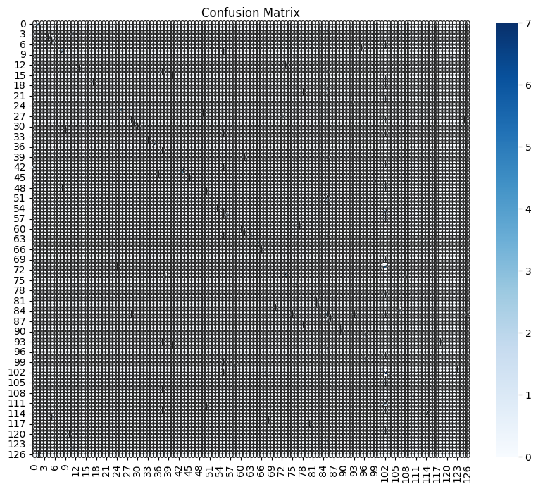

# social-media-sentiment-classification
Social Media Sentiment Classification Using Machine Learning

Project Overview

This project focuses on building and evaluating Machine Learning classification models to predict sentiments expressed in social media posts. By leveraging Natural Language Processing (NLP) techniques and classification algorithms, the project classifies posts into various sentiment categories such as Positive, Negative, Neutral, Joy, Anger, Sadness, Fear, Love, and Surprise.

The goal is to demonstrate an end-to-end Machine Learning workflow, including data preprocessing, feature engineering, model training, evaluation, and hyperparameter tuning.

⸻

Problem Statement

Social media platforms generate vast amounts of user-generated content daily. Understanding the emotions and sentiments behind these posts can help businesses, organizations, and researchers gain valuable insights into public opinion, customer satisfaction, and market trends.

This project aims to develop a machine learning model capable of automatically classifying social media posts into sentiment categories based on textual content.

⸻

Dataset Description

The dataset contains social media posts along with metadata and sentiment labels.

Features

Feature	Description
Text	Social media post content
Sentiment	Target variable representing emotional sentiment
Platform	Social media platform used
Username	User identifier
Hashtags	Associated hashtags
Likes	Number of likes received
Retweets	Number of retweets/shares
Country	User location
Year	Year of post
Month	Month of post
Day	Day of post
Hour	Hour of post

Target Variable

The target variable is Sentiment, which contains multiple sentiment categories such as:

* Positive
* Negative
* Neutral
* Joy
* Anger
* Sadness
* Fear
* Love
* Surprise

⸻

Project Workflow

1. Data Loading and Exploration

* Imported dataset into Google Colab.
* Inspected dataset structure and data types.
* Checked for missing values.
* Analyzed sentiment distribution.

2. Data Preprocessing

* Converted text data into numerical features using TF-IDF Vectorization.
* Encoded sentiment labels using LabelEncoder.
* Prepared data for machine learning models.

3. Exploratory Data Analysis (EDA)

* Visualized sentiment distribution.
* Examined class balance across sentiment categories.
* Generated descriptive insights from the dataset.

4. Model Development

The following classification algorithms were trained and evaluated:

Logistic Regression

A linear classification model commonly used for text classification tasks.

Decision Tree Classifier

A tree-based model capable of learning non-linear relationships in the data.

Random Forest Classifier

An ensemble learning method that combines multiple decision trees to improve prediction performance.

5. Model Evaluation

The models were evaluated using:

* Accuracy
* Precision
* Recall
* F1-Score
* Confusion Matrix

6. Hyperparameter Tuning

GridSearchCV was used to optimize the Random Forest model by searching for the best combination of parameters.

⸻

Results

After comparing the performance of all models, the Random Forest Classifier achieved the best overall results. Hyperparameter tuning further improved model performance and enhanced prediction accuracy across sentiment classes.

The project demonstrates how machine learning can effectively classify social media sentiments and support data-driven decision-making.

⸻

Visualizations

Sentiment Distribution

Displays the frequency of each sentiment category within the dataset.

Model Accuracy Comparison

Compares the performance of Logistic Regression, Decision Tree, and Random Forest models.

Confusion Matrix

Provides a detailed view of model predictions versus actual sentiment classes.

⸻

Technologies Used

* Python
* Google Colab
* Pandas
* NumPy
* Matplotlib
* Seaborn
* Scikit-Learn

⸻

Machine Learning Techniques Applied

* Natural Language Processing (NLP)
* TF-IDF Vectorization
* Label Encoding
* Classification Modeling
* Model Evaluation
* Hyperparameter Tuning
* Feature Engineering

⸻

Future Improvements

* Implement advanced NLP preprocessing techniques.
* Experiment with Deep Learning models such as LSTM and BERT.
* Deploy the model as a web application.
* Perform sentiment prediction on real-time social media data.

⸻

Key Skills Demonstrated

* Data Cleaning and Preprocessing
* Exploratory Data Analysis (EDA)
* Natural Language Processing (NLP)
* Machine Learning Classification
* Model Evaluation and Validation
* Hyperparameter Optimization
* GitHub Project Documentation

⸻

Author

Glory Anaga

Business Management Graduate | Aspiring Data Analyst | Machine Learning Enthusiast

Connect with me on LinkedIn and explore more of my data analytics projects.
LinkedIn:: https://www.linkedin.com/in/glory-anaga?utm_source=share_via&utm_content=profile&utm_medium=member_ios
